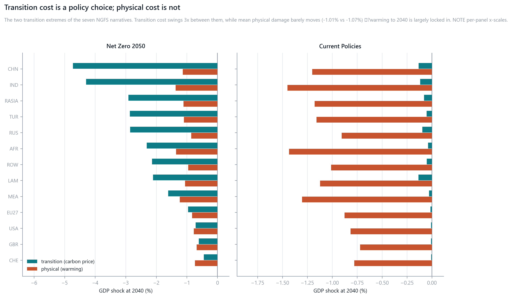
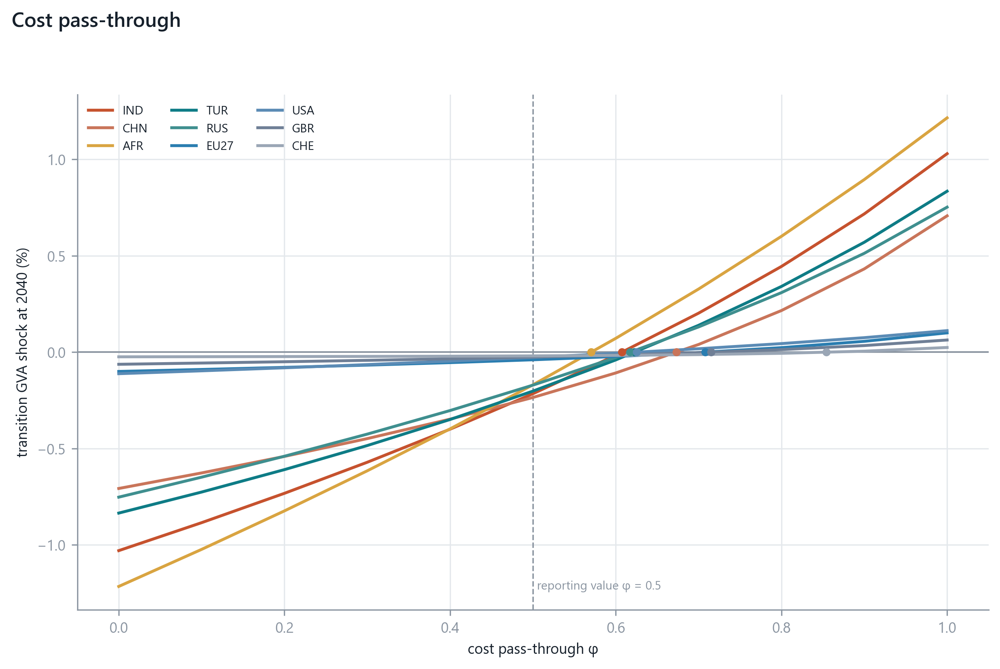
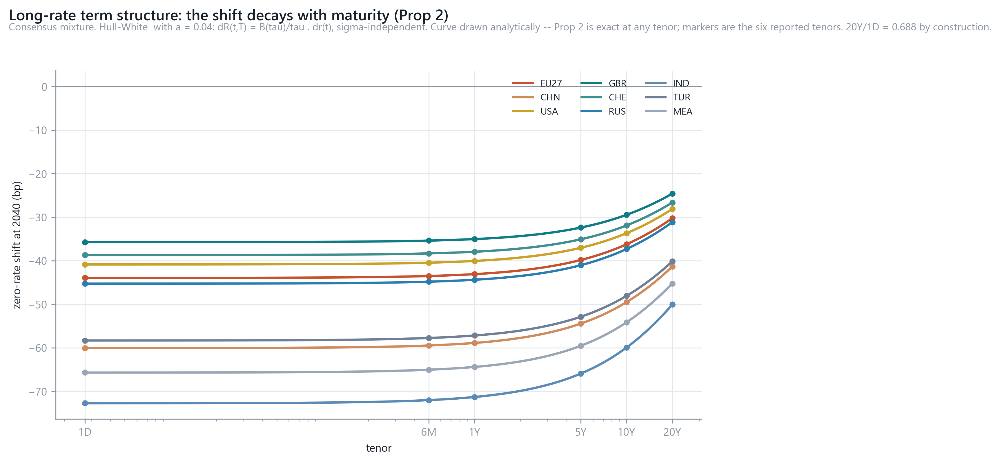
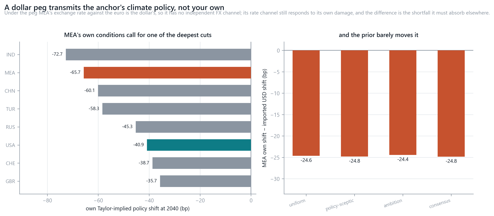
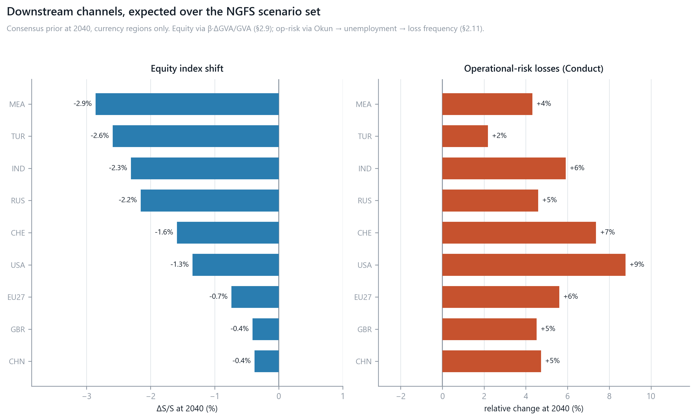
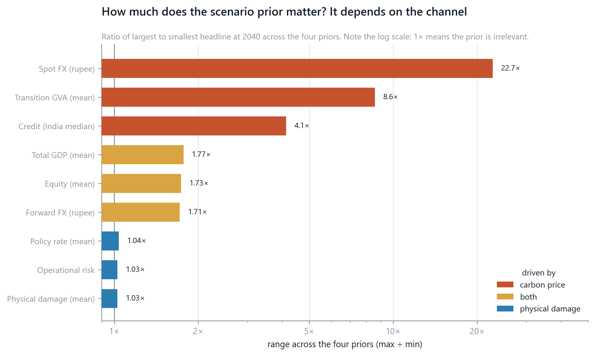
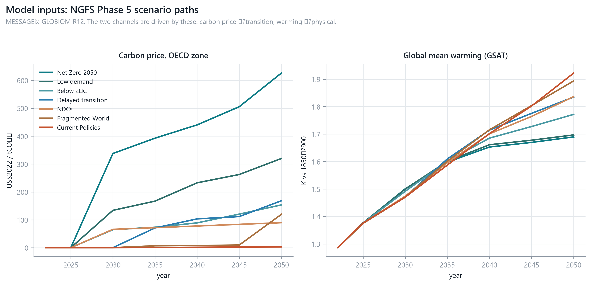

# Main Results

This section reports what the model produces when the machinery of the previous
chapter is applied to the thirteen-region calibration built from the OECD ICIO
tables. It follows the shock through the economy in the order the model computes
it: first the real-economy effects on value added, then the price and policy
response, and finally the three financial markets the exercise is aimed at —
exchange rates, interest rates and credit. Trade measures are held out entirely
and treated separately in the next section, so everything below is driven by
carbon pricing and warming alone.

## 1. Setup and reporting convention

### 1.1 The calibration in brief

The model resolves the world into thirteen regions covering 81 economies and 650
region-industry pairs, with a world gross output of \$199.7 trillion and value
added of \$93.8 trillion. Three region-level characteristics do most of the work
in what follows, and it is worth setting them out first, because almost every
ordering below can be traced to one of them.

| | most exposed | least exposed |
|---|---|---|
| Carbon intensity (t CO₂e / \$m) | India 574, Russia 467, Africa 456 | Switzerland 20, UK 61, EU27 87 |
| Carbon-pricing coverage | EU27 0.645, China 0.467, Switzerland 0.425 | India, Türkiye, Russia, Middle East all 0.000 |
| Physical vulnerability (ND-GAIN, world = 1) | India 1.34, Africa 1.34, Middle East 1.22 | UK 0.79, Switzerland 0.83, US 0.89 |

These three are close to independent of one another, which is why no single
ranking of "climate exposure" emerges from the results. India is extreme on two
of them; Switzerland is mild on all three; the EU is unusual in being the most
heavily *priced* economy while being among the least intensive.

### 1.2 Results are reported as a scenario mixture

The seven NGFS narratives are not competing forecasts to be chosen between. The
framework treats them as components of a Dirichlet-categorical mixture, so the
reported quantity is an expectation against a distribution over narratives rather
than the value under any one of them. That is the construction the single-region
study uses, and it is used here for the same reason: a scenario is a conditional
statement, and reporting one as though it were the answer silently assigns it
probability one.

Because the narrative is a categorical draw and the prior over its probability
vector is Dirichlet, conjugacy gives the weight on narrative *s* as
(α_s + n_s) / (α₀ + n). With no observed policy events this is simply the
normalised α, so a prior is fully described by where it places its mass.

**Table 1.** Prior weights over the seven narratives (per cent)

| Narrative | End-century warming | Uniform | Policy-sceptic | Ambition | **Consensus** |
|---|--:|--:|--:|--:|--:|
| Net Zero 2050 | 1.45 °C | 14.3 | 6.2 | 23.5 | 0.0 |
| Low demand | 1.47 | 14.3 | 6.2 | 17.6 | 0.0 |
| Below 2 °C | 1.69 | 14.3 | 6.2 | 23.5 | 0.3 |
| Delayed transition | 1.75 | 14.3 | 12.5 | 11.8 | 0.5 |
| NDCs | 2.03 | 14.3 | 25.0 | 11.8 | 6.7 |
| Fragmented World | 2.11 | 14.3 | 18.8 | 5.9 | 11.8 |
| Current Policies | 2.75 | 14.3 | 25.0 | 5.9 | **80.7** |

*Uniform* is the conventional uninformative choice. *Policy-sceptic* and
*ambition* are asserted bookends whose directions are narrative logic and whose
magnitudes are arbitrary. *Consensus* is the only one anchored on a citable
source: each narrative is weighted by a Gaussian in its own end-century warming
around the 2.7 °C that the UNEP Emissions Gap Report and Climate Action Tracker
independently place current policy on.

Only the **mean** of the Dirichlet is used. Reported weights are α_s / Σα, and
the distribution is never sampled, which makes the concentration parameter inert
for every number below — rescaling Σα from 14 to 140 leaves every weight
identical. It governs only the stiffness of the conjugate update, where it does
bite: three observations attributed to Current Policies would raise that weight
from 14.3 to 29.4 per cent at Σα = 14 but only to 16.1 per cent at Σα = 140.

### 1.3 The consensus prior carries the headline

Every table below reports the **consensus** expectation as its headline, with the
other three priors shown wherever the choice changes the reading. Two reasons.

It is the only prior in the set that answers to anything outside the model. The
other three encode a modelling convention or an assertion; consensus encodes a
published estimate of where current policy leads, and it can be argued with on
its own terms.

It also occupies the position the single-region study reserves for its own base
case. That study places 90 per cent on SSP2 and 90 per cent on RCP4.5, which
multiplies to 86.3 per cent of its realised probability mass on the single cell
(SSP2, RCP4.5) — a pathway that lands near 2.7 °C. Consensus puts 80.7 per cent
on Current Policies at 2.75 °C. Same anchor, same role, almost the same
concentration, reached from the same external citation.

Reporting more than one prior is not a departure from that study either. Its
Table 12 is computed at 90/90 and its Table 14 repeats the whole expectation at
20/20 — a uniform prior across the five SSPs with RCP4.5 merely double-weighted —
for exactly the reason given here, that the concentration is asserted rather than
estimated. What is done below is that comparison widened from two points to four,
and made a reported result rather than an appendix.

One consequence should be stated at the outset, because it runs through
everything that follows. **The consensus prior almost switches the transition
channel off.** Current Policies carries a carbon price near zero, so under this
prior the world is priced at close to nothing and the physical channel does
nearly all the work. Sections 2 and 7 quantify what that costs, and the reader
who wants the transition-heavy reading should take the ambition column.

### 1.4 Financial results are reported for currency regions only

Interest rates, exchange rates, credit spreads and equity indices are quoted
*for a currency and a market*. Four of the thirteen regions — Rest of Asia, Latin
America, Africa and Rest of World — are baskets assembled for input-output
closure, and the region map records their currency as literally `mixed`. A policy
rate for "Rest of World" would be an average over currencies with nothing in
common, and a CDS spread for it would price a basket no counterparty holds.

Sections 4 to 6 therefore report the **nine regions with a legal currency**:
EU27 (the base), the United States, the United Kingdom, Switzerland, China,
Russia, India, Türkiye and the Middle East. The real-economy results of §2 keep
all thirteen, because value added is not a currency quantity and the aggregate
regions are perfectly meaningful there.

The Middle East is included on a specific ground. Its members peg to the dollar,
and a peg is a currency arrangement rather than the absence of one. It has a
policy rate the model can compute and a credit market to attach spreads to; what
it does not have is an independent exchange rate, which turns out to be the most
interesting thing about it (§5.3).

Where a single narrative is shown it is **Net Zero 2050**, labelled as a
component — the case in which the transition channel is most visible, and
therefore an upper bound on it. Pass-through is set at φ = 0.5 except in §3,
where it is swept. Results are quoted at 2040 unless stated.

## 2. The real economy

The carbon charge enters as an ad-valorem cost wedge on each sector's own
emissions and propagates through the Leontief price dual; the damage channel
enters through Proposition 1, which allocates a global temperature-dependent loss
across regions in proportion to a vulnerability-weighted output vector. Both land
on regional value added, and the totals below are their sum.

**Table 2.** Total value-added shock at 2040, consensus mixture (%)

| Region | 2025 | 2030 | 2040 | 2045 |
|---|--:|--:|--:|--:|
| India | −0.95 | −1.21 | **−1.67** | −1.86 |
| Africa | −0.94 | −1.18 | −1.60 | −1.79 |
| China | −0.79 | −1.04 | −1.44 | −1.60 |
| Middle East | −0.86 | −1.06 | −1.43 | −1.59 |
| Türkiye | −0.76 | −1.00 | −1.37 | −1.53 |
| Rest of Asia | −0.77 | −0.97 | −1.33 | −1.48 |
| Latin America | −0.73 | −1.03 | −1.27 | −1.39 |
| Rest of World | −0.66 | −0.84 | −1.13 | −1.25 |
| Russia | −0.59 | −0.76 | −1.08 | −1.21 |
| EU27 | −0.57 | −0.68 | −0.92 | −1.02 |
| United States | −0.53 | −0.63 | −0.84 | −0.94 |
| Switzerland | −0.51 | −0.59 | −0.79 | −0.89 |
| United Kingdom | −0.47 | −0.55 | −0.74 | −0.83 |

The spread is a little over two to one from worst to best, and the ordering is
recognisably an ordering of physical vulnerability rather than of carbon
intensity. That is a direct consequence of the reporting prior, and the
decomposition makes it plain.

**Table 3.** The two channels at 2040, mean across the thirteen regions (%)

| Channel | Consensus | Uniform | Policy-sceptic | Ambition | Range |
|---|--:|--:|--:|--:|--:|
| Transition | **−0.13** | −0.84 | −0.57 | −1.08 | **8.6×** |
| Physical | **−1.08** | −1.06 | −1.07 | −1.05 | **1.03×** |

Physical damage is, to three per cent, the same number under every prior. This is
not a modelling assumption but a consequence of the scenario set: warming to 2040
is already largely determined by emissions to date, so the narratives disagree
about policy without much disagreeing about temperature at this horizon. They
disagree enormously about the carbon price, and the transition mean moves by a
factor of nearly nine across the four priors.

Under consensus the transition channel is −0.13 against −1.08 for physical, a
ratio of 8.6 to one. It
is worth being explicit that this is a statement about the prior and not about
transition risk: under ambition the two are comparable, and under Net Zero alone
the transition mean is −2.20 per cent, twice the physical. The chapter reports
consensus because the prior is defensible, not because transition risk is small.

## 3. Cost pass-through

The single free parameter in the transition channel is φ, the share of the carbon
charge a sector passes downstream rather than absorbing in its own value added.
The reported results use φ = 0.5. Because that value is a convention rather than
an estimate, the whole range is swept here.

The sweep is run inside every narrative and then mixture-weighted, like every
other channel. It is worth separating three things that behave quite differently
under that weighting, because the pass-through result is often quoted as though
it were a single object.

The **levels** are entirely scenario-scaled. The shock at any φ is proportional
to the carbon charge, so the whole curve stretches with the carbon price: the
φ = 0 charge is 37 times larger under Net Zero 2050 than under Current Policies,
and India's φ = 0 shock is −20.90 per cent on the Net Zero component against
−1.03 per cent under the consensus mixture. Nothing about the shape changes; only
the scale does.

The **structure** is scenario-free, and exactly so. The endpoint identity, the
mirror symmetry and the invariance of rates and exchange rates below all hold to
machine precision in all seven narratives, not merely in the one that happens to
be reported.

The **crossing** sits between the two. It moves a little with the scenario,
because a narrative that prices the OECD heavily and the rest of the world barely
changes which charges a sector imports rather than levies. The movement is small
— a median of 0.024 across the seven narratives, and 0.139 at most, for the UK.

**Table 4.** Transition GVA shock at 2040, consensus mixture, by pass-through (%)

| Region | 0.0 | 0.1 | 0.2 | 0.3 | 0.4 | **0.5** | 0.6 | 0.7 | 0.8 | 0.9 | 1.0 |
|---|--:|--:|--:|--:|--:|--:|--:|--:|--:|--:|--:|
| EU27 | −0.100 | −0.090 | −0.079 | −0.067 | −0.054 | **−0.040** | −0.022 | −0.002 | +0.023 | +0.056 | +0.100 |
| CHN | −0.707 | −0.627 | −0.541 | −0.449 | −0.348 | **−0.235** | −0.108 | +0.040 | +0.216 | +0.432 | +0.707 |
| USA | −0.112 | −0.097 | −0.081 | −0.065 | −0.047 | **−0.027** | −0.006 | +0.018 | +0.044 | +0.075 | +0.112 |
| GBR | −0.063 | −0.057 | −0.050 | −0.042 | −0.034 | **−0.025** | −0.015 | −0.002 | +0.013 | +0.034 | +0.063 |
| CHE | −0.024 | −0.024 | −0.023 | −0.022 | −0.021 | **−0.019** | −0.017 | −0.013 | −0.006 | +0.005 | +0.024 |
| RUS | −0.752 | −0.649 | −0.540 | −0.425 | −0.303 | **−0.171** | −0.028 | +0.131 | +0.309 | +0.513 | +0.752 |
| IND | −1.030 | −0.885 | −0.733 | −0.571 | −0.400 | **−0.216** | −0.016 | +0.202 | +0.445 | +0.717 | +1.030 |
| TUR | −0.835 | −0.726 | −0.610 | −0.485 | −0.349 | **−0.202** | −0.040 | +0.139 | +0.341 | +0.570 | +0.835 |
| RASIA | −0.465 | −0.410 | −0.352 | −0.290 | −0.221 | **−0.146** | −0.061 | +0.036 | +0.151 | +0.291 | +0.465 |
| LAM | −0.790 | −0.676 | −0.556 | −0.429 | −0.294 | **−0.151** | +0.004 | +0.172 | +0.355 | +0.559 | +0.790 |
| MEA | −0.659 | −0.561 | −0.458 | −0.350 | −0.236 | **−0.115** | +0.015 | +0.154 | +0.306 | +0.473 | +0.659 |
| AFR | −1.216 | −1.024 | −0.824 | −0.616 | −0.398 | **−0.170** | +0.072 | +0.328 | +0.601 | +0.896 | +1.216 |
| ROW | −0.533 | −0.458 | −0.379 | −0.295 | −0.206 | **−0.111** | −0.007 | +0.106 | +0.231 | +0.372 | +0.533 |

Columns are φ; the reporting value φ = 0.5 is set in bold. All thirteen regions
appear, since value added is not a currency quantity.

The endpoints are exact: at φ = 0 the shock is minus the region's carbon bill
over its value added, and at φ = 1 it is plus the same, because a sector that
passes everything downstream ends up collecting the charge rather than paying it.
Both identities hold to 7 × 10⁻¹⁵ in every narrative, as does the mirror symmetry
they imply. Every region's shock therefore changes sign somewhere in between.

Under the consensus mixture the crossings run from **0.570** (Africa) to
**0.854** (Switzerland), with the UK at 0.715 and India at 0.607. Taking all
thirteen regions across all seven narratives, every crossing without exception
falls in **[0.568, 0.917]** — that is, *above one half everywhere*. At the
reported φ = 0.5 every region is still a net loser, in every scenario. The dual
is not linear in φ, and the midpoint is not the neutral point.

The structural result does not appear in the figure at all, because there is
nothing to see: **pass-through does not touch the policy rate or the exchange
rate.** Both sit at exactly their φ = 0.5
values across the whole range — a spread of 0e+00 basis points on India's policy
rate and 0e+00 percentage points on its five-year forward, in every narrative —
because the Taylor rule responds to inflation and to physical damage, and neither
passes through the Leontief dual. Swept across φ they hold at −72.7 bp and −1.35
per cent, which are precisely the consensus figures of Tables 5 and 7.

What φ does reach is value added and, through it, credit: India's transition
shock swings from −378 to +578 per cent of its φ = 0.5 value and its credit
spread from +464 to −664 per cent.

The model's widest single uncertainty is therefore confined to two of the four
financial channels, and the two this chapter treats most carefully — rates and
exchange rates — are immune to it.

## 4. Interest rates

Inflation deviations follow the Moessner relation, 0.08 per cent per \$10/t of
carbon price applied to the share of emissions actually priced, and feed a Taylor
rule with equal weights on inflation and the output gap. The gap is the physical
damage alone: a carbon charge is a tax wedge, and a wedge redistributes rather
than destroys output, so it does not enter the term a central bank responds to.

**Table 5.** Policy-rate shift, consensus mixture (basis points)

| Currency region | 2025 | 2030 | 2040 | 2045 |
|---|--:|--:|--:|--:|
| India | −47.5 | −54.2 | **−72.7** | −81.2 |
| Middle East | −42.9 | −49.0 | −65.7 | −73.3 |
| China | −39.3 | −44.6 | −60.1 | −67.0 |
| Türkiye | −38.1 | −43.5 | −58.3 | −65.1 |
| Russia | −29.6 | −33.8 | −45.3 | −50.5 |
| EU27 | −28.7 | −32.6 | −44.0 | −49.1 |
| United States | −26.7 | −30.4 | −40.9 | −45.6 |
| Switzerland | −25.3 | −28.7 | −38.7 | −43.2 |
| United Kingdom | −23.4 | −26.5 | −35.7 | −39.9 |

Every rate falls, in every region, in every scenario, at every horizon. The
model contains no mechanism that could produce a climate-driven tightening on
net: the carbon price is inflationary and pushes rates up, but at a magnitude
that the damage term swamps. Under the consensus prior the point is close to
absolute. The inflation contribution to the 2040 shift never exceeds **0.07
basis points** for any currency region, against damage contributions of 35 to 73,
and it is exactly zero for India, Türkiye, Russia and the Middle East, which
price none of their emissions and so import no carbon inflation at all.

**This is the channel the prior barely touches.** The mean shift moves by 1.04×
across the four priors, because it is driven almost entirely by physical damage,
which the narratives agree on. A treasury desk with an interest-rate position can
use these numbers without holding a view on climate policy.

### 4.1 The term structure

Proposition 2 maps the short-rate shift onto the curve through the Hull-White
factor B(τ)/τ with a = 0.04.

**Table 6.** Zero-rate shift at 2040 by tenor, consensus mixture (basis points)

| | 1D | 6M | 1Y | 5Y | 10Y | 20Y |
|---|--:|--:|--:|--:|--:|--:|
| India | −72.7 | −72.0 | −71.3 | −65.9 | −60.0 | −50.1 |
| Middle East | −65.7 | −65.0 | −64.4 | −59.5 | −54.1 | −45.2 |
| China | −60.1 | −59.5 | −58.9 | −54.4 | −49.5 | −41.4 |
| Türkiye | −58.3 | −57.8 | −57.2 | −52.9 | −48.1 | −40.2 |
| Russia | −45.3 | −44.8 | −44.4 | −41.0 | −37.3 | −31.2 |
| EU27 | −43.9 | −43.5 | −43.1 | −39.8 | −36.2 | −30.3 |
| United States | −40.9 | −40.5 | −40.1 | −37.0 | −33.7 | −28.1 |
| Switzerland | −38.7 | −38.3 | −37.9 | −35.1 | −31.9 | −26.6 |
| United Kingdom | −35.7 | −35.4 | −35.0 | −32.4 | −29.5 | −24.6 |

The twenty-year shift is 0.6884 of the one-day shift for every region without
exception, matching the analytic ratio implied by a = 0.04 (B(20)/20 = 0.6883,
the small difference being the overnight leg, which is B(1/365)·365 rather than
exactly one). That is a useful check that the expansion behaves, and also a
limitation: a single mean-reversion parameter cannot express that some economies'
curves would steepen under climate stress while others flatten. All cross-region
variation comes from Δr and none from the curve, so the term structure rescales
the cross-section without reordering it. The prior barely disturbs any of it:
redrawing the whole table under the ambition prior instead moves no cell by more
than **2.75 basis points**, which at this scale would be invisible.

## 5. Exchange rates

The exchange-rate result follows the original study's definition of FX risk as
the difference between two countries' yield-curve changes, which separates into a
spot component driven by relative purchasing-power parity and a forward component
driven by covered interest parity. Rates are quoted as units of local currency
per euro, so a negative figure is appreciation against the euro.

**Table 7.** Five-year forward against the euro, consensus mixture (%)

| | 2025 | 2030 | 2040 | 2045 | Range over the four priors at 2040 |
|---|--:|--:|--:|--:|---|
| Indian rupee | −0.85 | −1.01 | **−1.35** | −1.51 | −1.35 to −2.31 |
| Chinese yuan | −0.48 | −0.55 | −0.74 | −0.82 | −0.74 to −1.03 |
| Turkish lira | −0.42 | −0.52 | −0.69 | −0.78 | −0.69 to −1.67 |
| US dollar | +0.09 | +0.08 | +0.10 | +0.11 | −0.75 to +0.10 |
| *Middle East (USD peg)* | *+0.09* | *+0.08* | *+0.10* | *+0.11* | *inherits the dollar* |
| Swiss franc | +0.16 | +0.17 | +0.22 | +0.25 | −0.12 to +0.22 |
| Pound sterling | +0.24 | +0.26 | +0.35 | +0.39 | −0.15 to +0.35 |

The first thing to say is that a strengthening currency is not good news.
Appreciation here reflects damage forcing deep rate cuts, which under covered
interest parity produce a forward premium; the ordering is closer to an ordering
of harm than of resilience. India leads it because it scores badly on both
relevant attributes at once — no carbon pricing, so no offsetting inflation, and
the highest physical vulnerability in the set.

**The prior decides the sign for exactly the currencies whose moves are small.**
The rupee, yuan and lira are negative under all four priors, and their whiskers
in the figure sit entirely below zero. The dollar, franc and sterling change sign
between the ambition prior (−0.75, −0.12, −0.15) and consensus (+0.10, +0.22,
+0.35). Nothing in the model resolves which is right, because it depends on
scenario weights the data does not supply. What can be said is that the disputed
moves are a few tenths of a percentage point, where the sign is not the
interesting quantity, while the moves that are an order of magnitude larger are
not in dispute at all.

### 5.1 Two structural properties

Every currency appreciates on the *spot* leg under every prior, and this is
forced rather than estimated. The EU27 holds the highest carbon-pricing coverage
in the set at 0.645 against 0.467 for the next, so every other region imports
less carbon inflation than the base and relative parity requires its currency to
strengthen. The result would reverse for any economy that came to price carbon
more heavily than the EU does.

The spot leg also carries very little independent information. Its correlation
with carbon-pricing coverage is +0.9999 on the Net Zero component, which is close
to mechanical: the six currencies map onto only three distinct NGFS carbon-price
paths, so the price varies by less than one per cent across the cross-section and
the spot vector is very nearly a rescaling of the coverage vector. India and
Türkiye, which both price nothing, are identical on spot to every reported digit.

### 5.2 Under this prior the forward is the rate differential

**Table 8.** The two legs at 2040, consensus mixture (%)

| | Spot (relative PPP) | 5-year forward (CIP) |
|---|--:|--:|
| Indian rupee | −0.043 | −1.35 |
| Turkish lira | −0.043 | −0.69 |
| US dollar | −0.037 | +0.10 |
| Pound sterling | −0.021 | +0.35 |
| Swiss franc | −0.015 | +0.22 |
| Chinese yuan | −0.007 | −0.74 |

Under the consensus prior the spot leg all but vanishes. It is four hundredths of
a percentage point at most, against forwards of over a percentage point, and the
two legs are **thirty-two times apart**. This is the transition channel
disappearing again: spot moves with the *inflation* differential, inflation comes
from the carbon price, and a prior concentrated on Current Policies prices almost
no carbon. Under the ambition prior the same two legs are only 2.4 times apart —
an order of magnitude closer together — which is as direct a demonstration as the
model offers that the spot leg *is* the transition channel.

Spot is by some distance the most prior-sensitive quantity in the model — the
rupee's spot move ranges over a factor of **22.7** across the four priors,
against 1.7 for its forward. The spot leg is pure transition risk, and transition
risk is what the prior is about.

### 5.3 What a currency peg does

Including the Middle East makes visible something none of the floating currencies
can show. Under a dollar peg the bilateral rate against the euro *is* the
dollar's, so the region has no exchange-rate channel of its own; its row in Table
7 is the dollar's row, exactly, by construction rather than by computation.

Its policy rate is a different matter. The Taylor rule responds to the region's
own damage, and the Middle East is among the most physically exposed regions in
the model, so its own conditions call for a cut of **−65.7 basis points** at 2040
— the second deepest of any currency region. The dollar it is pegged to delivers
**−40.9**.

The gap of roughly **25 basis points** is the climate component of the peg's
cost, and it is remarkably stable: −24.6, −24.8, −24.4 and −24.8 under the four
priors. That stability is not a coincidence. Both legs of the difference are
driven by physical damage, which is the part of the problem the narratives agree
about, so the prior has almost nothing to change.

This is a familiar constraint in an unfamiliar setting. A pegged economy imports
the anchor's monetary policy, and if climate damage falls unevenly across the two
then the peg transmits a policy calibrated to the wrong economy. The model puts a
number on the wedge without needing any machinery beyond what the rate channel
already contains, and the number will grow with the horizon, since both legs do.

## 6. Credit, equity and operational risk

All three channels in this section share a shape. Each takes the value-added
shock of §2 and converts it into a market price through an elasticity estimated
elsewhere and taken as given here — a regression slope for credit and equity, an
Okun coefficient for operational risk. None of them is re-estimated on this
model's data. What the multi-regional extension supplies is the *shock*; what the
original study supplies is the translation from a shock into a price.

Credit needs one step the other two do not. A CDS index is a basket of sectors
rather than an economy, so a regional value-added shock cannot be applied to it
directly. The sector-level shocks are therefore first blended into each of the
twelve indices using the original study's published weights, its Tables 7–8 —
Health Care, for instance, is 55 per cent manufacturing, where pharmaceuticals
sit, and 45 per cent human health and social work. The blend is taken *inside*
each region and weighted by sector size, so that an index is that region's own
version of the basket rather than a global one; in India, manufacturing output is
some thirty times the health-services figure and duly dominates that region's
Health Care index. Only then is the blended shock converted into a spread change,
through that index's estimated slope from Table 9. A negative slope means the
spread widens as value added falls, which is the ordinary case; two of the twelve
carry positive slopes and therefore move against the rest, for reasons taken up
below.

**Table 9.** CDS spread change, median across indices, consensus mixture (%)

| Region | 2025 | 2030 | 2040 | 2045 | Uniform at 2040 |
|---|--:|--:|--:|--:|--:|
| China | 0.89 | 1.38 | **1.93** | 2.15 | 4.37 |
| India | 0.73 | 1.24 | 1.78 | 1.98 | 5.90 |
| Türkiye | 0.74 | 1.21 | 1.67 | 1.87 | 4.20 |
| Russia | 0.55 | 0.89 | 1.33 | 1.51 | 3.59 |
| EU27 | 0.58 | 0.77 | 1.04 | 1.15 | 2.04 |
| Middle East | 0.32 | 0.64 | 0.90 | 1.00 | 2.06 |
| United Kingdom | 0.49 | 0.62 | 0.84 | 0.93 | 1.46 |
| Switzerland | 0.48 | 0.58 | 0.78 | 0.87 | 1.05 |
| United States | 0.27 | 0.36 | 0.49 | 0.54 | 1.16 |

Credit is the most prior-sensitive of the market channels after spot FX, at 4.1×,
and the reordering it produces is worth noting: under the uniform prior India
leads, while under consensus China does. India's exposure is disproportionately
to the carbon charge, which consensus discounts, whereas China's rests more on
its sectoral composition, which no prior can discount away.

**Table 10.** CDS spread change by index at 2040, consensus mixture, median
across the nine currency regions (%)

| Index | Change | Table 9 slope β |
|---|--:|--:|
| Health Care | **+3.87** | −3.417 |
| Utilities | +2.97 | −1.510 |
| Basic Materials | +2.52 | −1.971 |
| Consumer Goods | +2.34 | −2.328 |
| Industrials | +1.83 | −1.751 |
| Oil & Gas | +1.70 | −1.325 |
| Consumer Services | +0.48 | −0.590 |
| Government | +0.47 | −3.112 |
| Telecommunications | +0.20 | −0.713 |
| Technology | +0.11 | −0.382 |
| Financials | **−0.38** | +2.078 |
| UK Real Estate | **−0.82** | +7.206 |

Credit is by far the most sector-specific of the channels. Decomposing the
variance across the nine-by-twelve grid attributes **72 per cent** of it to the
sector and only **14 per cent** to the region: which industries a book is exposed
to matters five times more than which country it sits in. The largest single cell
in the model is Indian health-care credit at +11.0 per cent.

The regression slope fixes the sign of each index exactly — all ten
negative-slope indices widen and both positive-slope indices narrow, across all
nine regions without exception — but accounts for only about half the variation
in size, correlating −0.70 with the median widening. The remainder comes from
which sectors each index is built from.

Financials and UK real estate narrow rather than widen, and this deserves care.
The original study's own estimates give both a positive slope, so a fall in value
added compresses their spreads. That is a property of the sample those
regressions were estimated on, and it is inherited unchanged here. It should not
be read as a finding that climate stress improves bank or property credit.

### 6.1 Equity and operational risk

Equity applies a market beta to the total value-added shock. Operational risk
runs the physical shock alone through Okun's law into unemployment and then into
loss frequencies, on the same argument used for the Taylor rule: a tax wedge
destroys no output and therefore costs no jobs.

**Table 11.** Equity index and conduct-loss shifts at 2040, consensus mixture (%)

| Region | Equity | β | Op-risk (conduct) | Base unemployment |
|---|--:|--:|--:|--:|
| Middle East | **−2.86** | 2.00\* | +4.31 | 5.97 |
| Türkiye | −2.59 | 1.89 | **+2.18** | 10.46 |
| India | −2.31 | 1.38 | +5.91 | 4.82 |
| Russia | −2.15 | 2.00\* | +4.59 | 3.87 |
| Switzerland | −1.59 | 2.00\* | +7.37 | 4.12 |
| United States | −1.34 | 1.59 | **+8.77** | 3.65 |
| EU27 | −0.74 | 0.80 | +5.60 | 6.16 |
| United Kingdom | −0.41 | 0.55 | +4.51 | 3.77 |
| China | **−0.38** | 0.26 | +4.73 | 4.98 |

\* proxy value, applied where no index history is available.

The two orderings differ sharply, and the reason is instructive. Equity runs on
the total shock through a beta; operational risk runs on physical damage through
a *base rate*. Türkiye is second-worst on equity and last on operational risk
because its base unemployment of 10.5 per cent makes a given rise a small
relative change, while the United States, with 3.65 per cent, turns a smaller
absolute rise into the largest relative one in the table. The denominator, not
the shock, drives that ranking.

China is the sharpest case in the chapter. It is **first** on credit and **last**
on equity, on the same underlying value-added shock, because its estimated market
beta is 0.26 — the lowest in the set — while its sectoral composition is heavily
weighted to the industries the credit channel punishes. Two desks looking at the
same country through two instruments would reach opposite conclusions, and
neither would be wrong about its own instrument.

The equity column should be read with the asterisks in mind: three of the nine
currency regions share the proxy beta of 2.00 for want of an index history, so
part of what looks like a cross-section of exposure is a cross-section of data
availability. Restricting to currency regions improves this — seven of thirteen
regions carry the proxy, against three of nine here — but does not remove it.

## 7. Where the uncertainty lies

### 7.1 The prior matters for some channels and not others

Collecting the prior sensitivity of every channel gives the section's organising
result.

**Table 12.** Range across the four priors at 2040 (max ÷ min)

| Channel | Range | Driven by |
|---|--:|---|
| Spot FX (rupee) | **22.7×** | carbon price |
| Transition GVA (mean) | 8.6× | carbon price |
| Credit (India median) | 4.1× | carbon price |
| Total GDP (mean) | 1.8× | both |
| Equity (mean) | 1.7× | both |
| Forward FX (rupee) | 1.7× | both |
| **Policy rate (mean)** | **1.04×** | physical damage |
| **Operational risk** | **1.03×** | physical damage |
| **Physical damage (mean)** | **1.03×** | physical damage |

The split is clean, and it is the same distinction that ran through §2: channels
carrying the carbon charge inherit the full disagreement between the narratives,
while channels carrying physical damage are nearly indifferent to it. An
institution whose exposure runs through interest rates or employment can take
these results without holding a view on climate policy. One whose exposure runs
through carbon-intensive credit or the spot currency cannot, and should quote a
range rather than a number.

### 7.2 What the mixture is made of

**Table 13.** Per-scenario components at 2040 (2045 for the FX range)

| Scenario | Transition mean (%) | Physical mean (%) | FX forward range (pp) | Credit median (%) |
|---|--:|--:|--:|--:|
| Net Zero 2050 | −2.20 | −1.01 | 3.30 | 3.78 |
| Low demand | −1.19 | −1.02 | 2.43 | 2.44 |
| Delayed transition | −0.88 | −1.09 | 2.12 | 2.01 |
| Below 2 °C | −0.68 | −1.05 | 2.07 | 1.78 |
| NDCs | −0.58 | −1.07 | 2.02 | 1.70 |
| Fragmented World | −0.27 | −1.09 | 1.91 | 1.12 |
| Current Policies | −0.06 | −1.07 | 1.88 | 0.82 |

The transition mean varies by a factor of thirty-seven across the narratives; the
physical mean by eight per cent. Exchange rates span only 1.8 because their two
components move in opposite directions — ambitious policy means a high carbon
price and large spot dispersion but low warming, weak policy the reverse —
leaving a floor of roughly 1.9 percentage points of dispersion that no narrative
removes. Transition risk is a policy choice; physical risk, at this horizon, is
not.

### 7.3 The tail

Stressing the inputs by 1.64 standard deviations — temperature from the MAGICC
ensemble and the carbon price from the cross-model spread — gives a
95th-percentile-input reading. The stress is applied *inside each of the seven
narratives* and the results mixed, so that the tail and the central case are
computed on the same footing.

**Table 14.** Central and stressed five-year forward at 2040, consensus (%)

| | Central | Stressed |
|---|--:|--:|
| Indian rupee | −1.35 | −1.75 |
| Chinese yuan | −0.74 | −0.98 |
| Turkish lira | −0.69 | −0.96 |
| US dollar (and the pegged Middle East) | +0.10 | +0.03 |
| Swiss franc | +0.22 | +0.23 |
| Pound sterling | +0.35 | +0.37 |

The cross-sectional range widens from 1.70 to 2.12 percentage points. That is the
right way to read this channel: the stress spreads the cross-section rather than
shifting a level, which is what one should expect of a quantity defined by
relative prices. The currencies that appreciate do so more, and the three that
sit near zero barely move, because under a consensus prior the carbon-price
component of the stress has almost nothing to act on — Current Policies prices
close to zero carbon and its cross-model spread is correspondingly small. Under
an ambition prior the same stress is roughly three times larger.

## 8. The channels do not agree

Ranking the worst-affected currency regions by each channel, under the consensus
prior, produces four different answers.

**Table 15.** Five worst-affected currency regions by channel, 2040

| Channel | 1 | 2 | 3 | 4 | 5 |
|---|---|---|---|---|---|
| FX forward | India | **China** | Türkiye | United States | Switzerland |
| Policy rate | India | **Middle East** | China | Türkiye | Russia |
| Credit | **China** | India | Türkiye | Russia | EU27 |
| Equity | **Middle East** | Türkiye | India | Russia | Switzerland |

India is in the first three everywhere, and beyond that the orderings diverge.
Each divergence is traceable to what the channel weights.

The United States is fourth on exchange rates and last on credit. Exchange rates
are a *relative* price against the euro, and the US pays for pricing almost none
of its emissions while the EU prices most of them; its currency moves on a
differential it did not choose. Credit is an *absolute* shock, and the US economy
is not carbon-intensive, so its spreads barely move.

China is first on credit and last on equity, for the reason given in §6.1: a
sectoral composition the credit channel punishes and a market beta of 0.26 that
mutes everything the equity channel would otherwise transmit.

The Middle East is second on rates and first on equity but has no exchange-rate
row of its own, because the peg hands that channel to the dollar.

The general conclusion is that "climate exposure" is not one quantity. The
channels weight the same two underlying shocks differently: exchange rates by
*relative* carbon pricing, policy rates by *absolute* damage, credit by *sectoral
composition*, and equity partly by the availability of a market beta. An
institution with European credit exposure, one with emerging-market currency
exposure and one with a domestic interest-rate position face identical warming
and identical carbon prices, and would rank their worst regions differently.

## 9. Limitations

Several caveats attach to the numbers above and should be carried into any
interpretation of them.

The prior is not data. NGFS publishes no scenario probabilities, and three of the
four priors used here are the modeller's construction; only consensus is anchored
on a citable external estimate, and that estimate is itself a projection.
Reporting four side by side is a way of being honest about that rather than a way
of resolving it, and §7.1 identifies which results survive the choice. The
headline prior in particular is one that nearly switches the transition channel
off, which is a defensible reading of where policy currently stands and a poor
description of a world that decarbonises.

The credit betas are estimated on a single national sample and applied to every
region. The sign anomaly on financials and real estate is direct evidence that
those regressions carry period-specific structure, and there is no reason to
expect the spread-to-value-added elasticity to travel to Indian or Turkish
credit. The same applies, more weakly, to the operational-risk slopes.

Three of the nine currency regions share one equity beta, so that cross-section
is partly an artefact of which regions have an accessible index history.

The exchange-rate cross-section rests on six floating currencies plus one peg.
Correlations computed on six points are indicative rather than estimates, and
none should be quoted with a standard error.

Restricting the financial channels to currency regions is a reporting choice, not
a claim that the excluded regions face no financial risk. Africa carries one of
the largest real shocks in the model, and a bank lending there is exposed to it;
what the model cannot do is name the currency that exposure is denominated in.

Results are reported as *shifts* rather than levels, because the market curve
that would anchor them is deliberately omitted in order to isolate the
climate-attributable component. One consequence is that nothing imposes a zero
lower bound on the implied policy rate.

The spot channel rests on relative purchasing-power parity, a poor description of
exchange rates at short horizons; the forward channel, resting on covered
interest parity, is the sounder of the two. The peg result of §5.3 assumes the
peg holds, which is precisely what a large enough differential would eventually
call into question.

Finally, there is an unresolved ambiguity in the currency to which the inflation
coefficient should be applied. The original study writes it against a dollar
carbon price, but its own published results are reproduced only when it is
applied to a sterling price. This model applies it to dollars. If the original
reading is correct, every spot level reported here is overstated by the
sterling–dollar rate, roughly a third. Ratios between currencies and their
ordering are unaffected, since the factor is common to both legs of every
difference; the levels are not.

No external benchmark exists for the exchange-rate or credit numbers themselves.
The GDP shocks do sit inside the range of NGFS's own macroeconomic estimates,
which is some comfort about the scale of the underlying real shock, but a −1.4
per cent expected forward on the rupee has nothing to be compared against.
