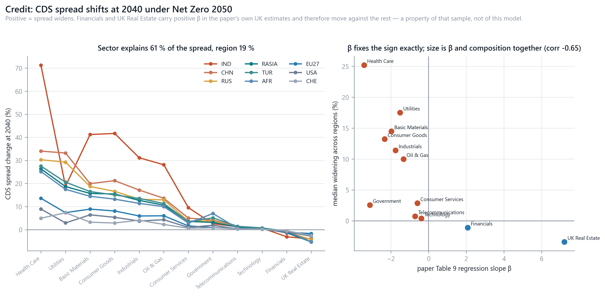

# Results: Exchange Rates, Interest Rates and Credit

## 1. What this chapter reports

The preceding chapters deliver two real-economy shocks per region — a carbon
charge propagated through the multi-regional Leontief dual, and a
temperature-driven damage allocated by vulnerability — and convert them into a
policy rate. This chapter reports what those become in three financial markets:

| channel | mechanism | paper |
|---|---|---|
| **Interest rates** | Taylor rule → Hull–White term structure | §2.7, §2.8 |
| **Exchange rates** | relative PPP (spot) + covered interest parity (forward) | §4.3 |
| **Credit** | sector GVA shock → synthetic index → regression β | §2.9 |

All three descend from the same two shocks, so the interesting question is not
whether they move — they must — but whether they order regions the *same way*.
They do not, and §6 is about why.

Unless stated, results are at **2040** under **Net Zero 2050**, on the 13-region
calibration of [CHAPTER_REGION_SELECTION.md](CHAPTER_REGION_SELECTION.md), with
pass-through φ = 0.5. Reproduce with `py -3 -m bkmn.run_extensions`.

---

## 2. Interest rates

The policy rate follows §2.7's Taylor rule with φ_Π = φ_Y = 0.5, whose output-gap
term is the damage function Ω(ΔT) rather than the carbon charge — a tax wedge
moves value to the exchequer without destroying output, so it is not an output
gap ([FX_REPORT.md](FX_REPORT.md) §7a).

Short-rate shift at 2040 (bp):

| IND | AFR | MEA | TUR | RASIA | CHN | LAM | ROW | RUS | EU27 | USA | CHE | GBR |
|--:|--:|--:|--:|--:|--:|--:|--:|--:|--:|--:|--:|--:|
| −68.5 | −66.9 | −61.9 | −54.9 | −54.4 | −54.2 | −50.8 | −47.0 | −42.6 | −39.0 | −38.1 | −34.9 | −32.4 |

**Every region cuts, in every scenario, at every horizon** — 0 of 91
region-scenario pairs shows a rise. That is not a finding about central banks so
much as arithmetic: carbon-driven inflation deviations are single-digit basis
points while damage is of order 1 % of GDP, so the output-gap term outweighs the
inflation term by roughly two orders of magnitude. Climate stress in this model
is **net disinflationary**: demand destruction beats cost-push.

The one place the inflation term bites is 2030, and it is an artefact worth
knowing about. NGFS publishes the carbon price at 0 in 2025 and \$337.80 in 2030,
so linear interpolation gives a constant \$67.56/yr increment across 2026–2030
against \$9.53/yr in the late 2030s. The inflation channel responds to the
*increment*, so it spikes: at 2030 it contributes **105 %** of the EU's rate move
(+17.4 bp against −34.1 bp of damage), and only 6 % at 2040. Every rate path in
the model therefore has a kink at 2030 that belongs to the five-year publication
grid rather than to any economics. (At 2030 the EU's damage term is −34.2 bp
against an inflation offset of +17.4 bp.)

### 2.1 The term structure adds nothing to the cross-section

Proposition 2 gives the zero-rate shift at tenor τ as ΔR(τ) = B(τ)/τ · Δr, with
B(τ) = (1−e^{−aτ})/a and a = 0.04 shared by every region. So the curve **rescales**
the short-rate shift and cannot reorder regions:

| | 1D | 6M | 1Y | 5Y | 10Y | 20Y |
|---|--:|--:|--:|--:|--:|--:|
| IND | −68.5 | −67.8 | −67.2 | −62.1 | −56.5 | −47.2 |
| EU27 | −39.0 | −38.6 | −38.2 | −35.3 | −32.1 | −26.8 |

The 20Y/1D ratio is **0.6884** for every region, against B(20)/20 = 0.6883 — a
gated identity. All cross-region variation lives in Δr; none of it in the curve.
That is a modelling limitation as much as a result: a single mean-reversion
parameter cannot express that some economies' curves would steepen and others
flatten.

---

## 3. Exchange rates

FX follows the paper's §4.3 route — "the difference in the changes of yield
curves" — which in a multi-regional setting splits into two channels:

$$\Delta\log S_r(t) = \mathrm{cum}\Pi_r(t) - \mathrm{cum}\Pi_{\mathrm{EUR}}(t),
\qquad
\Delta\mathrm{pts}_r(t,\tau) = B(\tau)\bigl[\Delta r_r(t) - \Delta r_{\mathrm{EUR}}(t)\bigr]$$

with the total forward their sum. Convention: S_r is units of r per euro, so a
**negative** figure means r *appreciates*.

Five-year forward at 2045 (%):

| INR | TRY | USD | CNY | GBP | CHF |
|--:|--:|--:|--:|--:|--:|
| −4.01 | −3.38 | −2.23 | −1.49 | −1.01 | −0.71 |

**A strengthening currency here is a distress signal, not strength.** It reflects
damage forcing deep rate cuts, which under covered interest parity produce a
forward premium. The ordering above is close to an ordering of harm, and India
and Türkiye lead it because they score badly on *both* attributes: little carbon
pricing, so no offsetting inflation, and high exposure, so deep cuts.

Two properties of this cross-section are structural rather than empirical, and
both are gated:

**Every currency appreciates on spot, and that is forced.** EU27 holds the
highest carbon-pricing scope in the set (0.645 against 0.467 for China), so
relative PPP *requires* every other currency to strengthen against the euro —
each imports less carbon inflation than the base. An earlier 20-region build
showed sign reversals for Japan, Korea and Norway; all three had scope *above*
the EU's, which is exactly the condition, and none survives the derived region
selection.

**Spot carries almost one piece of information.** Its correlation with
carbon-pricing scope is **+0.9999**, which is mechanical: the six FX regions map
onto only three NGFS carbon-price paths, so the price varies just \$494.89–\$505.61
at 2045 and spot is very nearly a rescaled scope vector. India and Türkiye, both
at zero scope, are *identical* on spot to every digit.

Full FX results, including the scenario mixture and the tail, are in
[FX_REPORT.md](FX_REPORT.md).

---

## 4. Credit

§2.9's CDS half transmits the shock in two steps. A credit index is not the whole
economy, so the sector shocks are first blended into a synthetic index using the
paper's published Tables 7–8 weights, then passed through its Table 9 regression
slope:

$$\Bigl(\tfrac{\Delta V}{V}\Bigr)_{j,r}
= \frac{\sum_i w_{ij}\, x_{i,r}\, (\Delta V/V)_{i,r}}{\sum_i w_{ij}\, x_{i,r}},
\qquad
\Delta s_{j,r} = \beta_j \Bigl(\tfrac{\Delta V}{V}\Bigr)_{j,r}$$

Both tables are **published**, so this channel needs no licensed data to run —
only to *re-estimate* β per region, which we do not attempt. The UK slopes are
applied to every region, the same [PROXY] treatment `OPRISK_BETA` already
receives and for the same reason.

Two implementation details carry over from the single-region reproduction, which
established both against the paper's printed rows rather than its text: the size
weight is **total output**, not GVA (`SIZE` switches it), and the physical damage
reaches this channel through Proposition 1's *cascading* form, added to the
charge vector before the dual.

### 4.1 Widening is mostly a sector story

Median CDS spread change across regions at 2040 (%):

| Health Care | Utilities | Basic Materials | Consumer Goods | Industrials | Oil & Gas | Consumer Svs | Government | Telecoms | Technology | Financials | Real Estate |
|--:|--:|--:|--:|--:|--:|--:|--:|--:|--:|--:|--:|
| 25.2 | 17.5 | 14.5 | 13.2 | 11.4 | 10.0 | 2.9 | 2.5 | 0.7 | 0.4 | −1.1 | −3.4 |

A variance decomposition puts **61 % of the spread between sectors** and only
19 % between regions. The widest single cell is Indian Health Care at **+71.3 %**;
the narrowest is Asian real estate at **−5.3 %**.

**β fixes the sign exactly.** All ten negative-β indices widen and both positive-β
indices narrow, without exception across 13 regions — a gated property. It does
*not* fix the size: the correlation between β and median widening is **−0.655**,
so roughly half the cross-sector variation comes from which sectors each index is
built from rather than from the regression slope.

**Financials and UK Real Estate move against everything else**, and this needs
stating plainly rather than explaining away. The paper's own Table 9 gives them
*positive* slopes (+2.08 and +7.21), so a GVA fall narrows their spreads. That is
a property of the UK sample the regressions were estimated on — plausibly the
post-2008 period, when financial spreads and output moved together for reasons
unrelated to climate — and it is inherited wholesale by every region here. It
should not be read as a finding that climate stress improves bank or property
credit.

### 4.2 The regional ordering

Median across sectors (%): **IND 14.2**, CHN 9.3, AFR 8.5, RUS 8.3, TUR 8.2,
RASIA 7.1, ROW 6.2, LAM 5.6, MEA 3.9, EU27 3.8, GBR 2.6, USA 2.4, **CHE 1.5**.

A near-tenfold span between India and Switzerland, driven by carbon intensity
(574 against 20 t/\$m) compounding through the same twelve baskets.

### 4.3 A caution on the FTSE column

The credit table carries an FTSE column, because the paper's Table 9 includes the
equity index in the same regression set. **It is not comparable to this model's
equity results** and should not be quoted as such. It applies the paper's UK
slope of 2.00 to every region, whereas `equity.py` uses region-calibrated betas
where an index history exists (EU27 = 0.80, CHN = 0.26, USA = 1.59). That
difference, compounded with index weighting, makes the two routes differ by
**1.2×–11.7×** and correlate only 0.52 across regions. The column is retained as
a structural cross-check on the weighting, not as a result.

---

## 5. Scenario dependence

Median credit widening across all region-sector cells at 2040:

| Net Zero | Low demand | Delayed transition | Below 2 °C | NDCs | Fragmented World | Current Policies |
|--:|--:|--:|--:|--:|--:|--:|
| 3.95 % | 2.46 % | 2.14 % | 1.89 % | 1.79 % | 1.12 % | 0.82 % |

Credit spans **4.8×** across scenarios — far more than FX, whose forward
dispersion spans only 1.8×. The reason is that credit here is driven almost
entirely by the *transition* channel, which is what policy chooses, while FX
carries a physical-damage floor that policy cannot remove ([FX_REPORT.md](FX_REPORT.md)
§4). The two channels answer different questions: credit asks what carbon pricing
costs, FX asks what warming costs net of what pricing offsets.

---

## 6. The channels do not agree, and the disagreement is the result

Ranking the worst-affected regions by each channel:

| channel | 1 | 2 | 3 | 4 | 5 |
|---|---|---|---|---|---|
| FX forward | IND | TUR | USA | CHN | GBR |
| rate cut | IND | AFR | MEA | TUR | RASIA |
| credit | IND | CHN | AFR | RUS | TUR |
| equity | RASIA | IND | TUR | RUS | AFR |

India is first or second everywhere; beyond that the orderings diverge sharply,
and each divergence is traceable:

**The USA is 3rd on FX and 12th on credit.** FX is a *relative* price against the
euro, and the US pays for having almost no carbon pricing (scope 0.091) while the
EU has a lot — its currency moves on a differential it did not choose. Credit is
an *absolute* shock, and the US economy is not carbon-intensive (118 t/\$m), so
its spreads barely move.

**RASIA is 1st on equity and 6th on credit.** Equity runs through a beta, and
RASIA carries the proxy β = 2.00 where China's fitted β is 0.26 — so the ordering
partly reflects which regions have index data, not which are most exposed.

**AFR is 2nd on rates and 3rd on credit but has no FX result at all.** It is a
structural region without a single analytical currency, which is a coverage limit
of the region selection rather than a statement about African exchange rates.

The general point: a single "climate exposure" ranking would be misleading.
Exposure is channel-specific because the channels weight the same two underlying
shocks differently — FX by *relative* carbon pricing, rates by *absolute* damage,
credit by *sectoral composition*.

---

## 7. Limitations

**Credit betas are UK estimates used everywhere.** Table 9 was estimated on UK
and European names; applying it to Indian or African credit assumes the
spread-to-GVA elasticity travels. It very likely does not, and the sign anomaly
on Financials and Real Estate (§4.1) is direct evidence that the sample carries
period-specific structure.

**No banking-book credit loss.** §2.10's IFRS 9 expected-credit-loss machinery
hangs off CDS-implied PDs and is not implemented, so nothing here converts a
spread move into a loss provision.

**7 of 13 regions share one equity beta.** CHE, RUS, RASIA, LAM, MEA, AFR and ROW
all take the proxy 2.00 for want of an index history, so the equity cross-section
is partly an artefact of data availability.

**The term structure cannot reorder regions** (§2.1), because a single
mean-reversion parameter is shared.

**Six analytical currencies** is a thin FX cross-section; correlations computed
on six points are indicative, not estimates.

**Every spot level may be 34 % too large.** The paper's printed inflation row is
reproduced only if the Moessner coefficient is applied to a *sterling* price; we
apply it to USD. Ratios and rankings are unaffected, levels are not — see
[PAPER_AUDIT.md](PAPER_AUDIT.md) §23b.

**No external validation of these numbers.** The GDP shocks sit inside NGFS's own
NiGEM range, and the structural properties are gated
([CHAPTER_VALIDATION.md](CHAPTER_VALIDATION.md)), but a −4 % INR forward or a
+71 % Indian Health Care spread has no external benchmark.

---

## 8. Summary

Climate stress reaches all three markets through the same two shocks and arrives
looking different in each.

**Rates** fall everywhere, unconditionally, because damage of order 1 % of GDP
overwhelms carbon inflation of order 5 bp. The spread between regions is 36 bp at
2040 (−32.4 to −68.5), and the term structure rescales it without reordering.

**Exchange rates** are a relative price, so they reward being *unlike* the base
region rather than being unharmed. Every currency in the set appreciates against
the euro, which is forced by the EU holding the highest carbon-pricing scope, and
the appreciation is a distress signal rather than strength.

**Credit** is the most sector-specific of the three — 61 % of its variation is
between sectors, only 19 % between regions — and the most policy-sensitive,
spanning 4.8× across scenarios against FX's 1.8×.

The disagreement between their regional orderings is the substantive result: it
shows that "climate exposure" is not one quantity. A bank with EU credit exposure,
a fund with EM currency exposure and a sovereign with a domestic rate exposure
face the same warming and the same carbon prices, and rank their worst-affected
regions differently.
