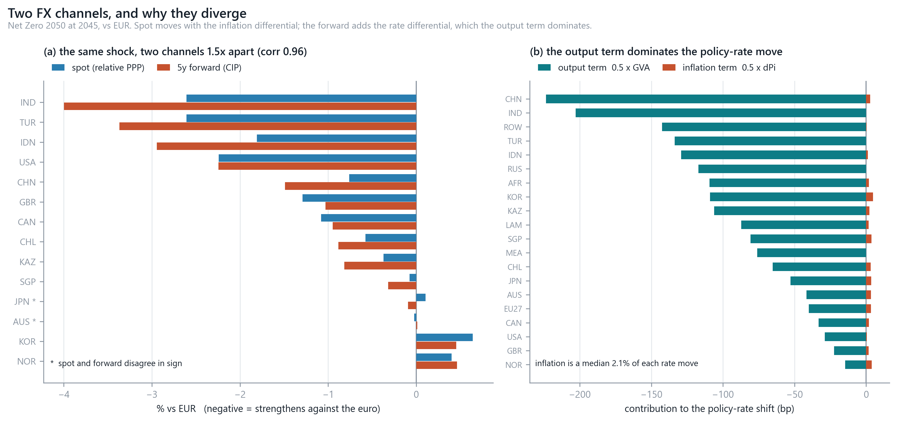
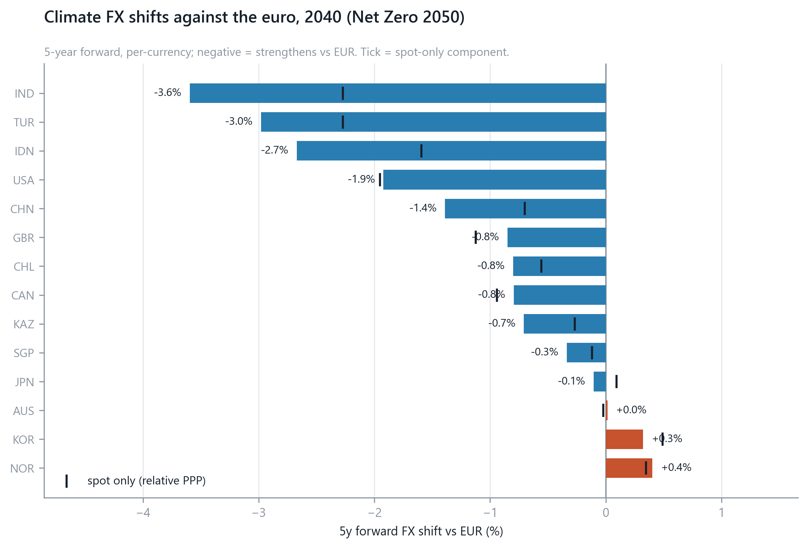
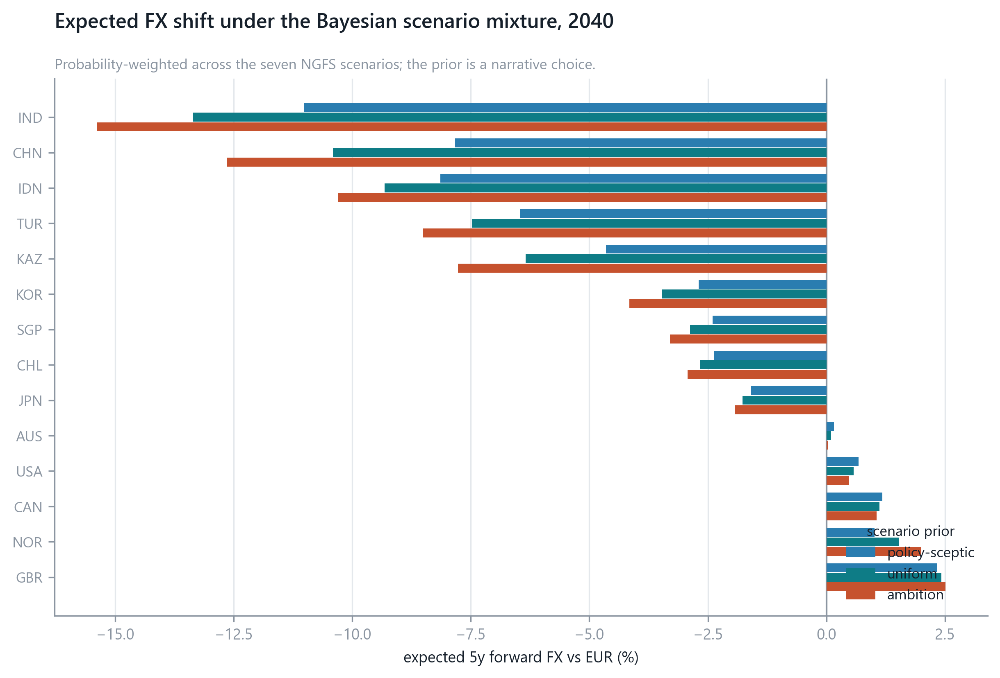
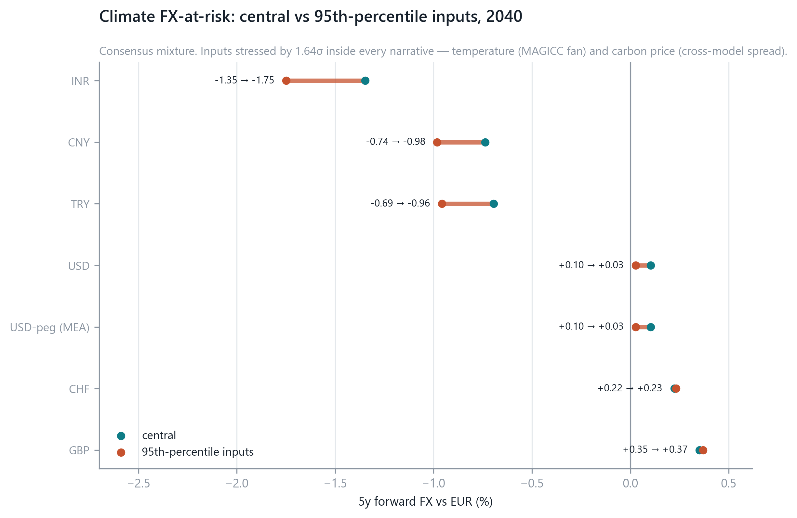

# FX results: the carbon channel

Results report for the multi-regional BKMN model, **carbon pricing only** — no
tariffs. **13 regions, 6 analytical currencies** against the euro, NGFS Phase 5
scenarios, horizons 2025–2045.

The region set is derived rather than asserted — see
[CHAPTER_REGION_SELECTION.md](CHAPTER_REGION_SELECTION.md) — and the calibration
tables are in [`DATA_final/`](../DATA_final/). Method detail is in
[FX_RESULTS.md](FX_RESULTS.md); this note is the results narrative. Tariff shocks
are separate, in [TARIFF_METHOD.md](TARIFF_METHOD.md).

Everything below is reproduced by `py -3 -m bkmn.run_fx` and
`py -3 tools/make_figures.py`; gates in `tests/test_fx.py` (9),
`tests/test_extensions.py` (92) and `tests/test_validation.py` (44, structural —
see [CHAPTER_VALIDATION.md](CHAPTER_VALIDATION.md)).

---

## 1. The result in one figure

The paper takes FX from *"the difference in the changes of yield curves"*
(§4.3). In a multi-regional setting that splits into two channels which carry
**different information** — correlation 0.90 at 2045, and quite different
cross-sectional orderings.

| | mechanism | driven by | range at 2045 (Net Zero) |
|---|---|---|--:|
| **Spot** | relative PPP — cumulative inflation differential | the carbon **price** | 1.85 pp |
| **5y forward** | spot + CIP rate differential | + physical **damage** | 3.28 pp |

## 2. The two channels price different risks

Correlating each against what a region can be — a carbon *taxer*, a
*climate-vulnerable* economy, or a *carbon-intensive* one (2045, Net Zero):

| | vs carbon-pricing **scope** | vs physical **damage** | vs carbon intensity |
|---|--:|--:|--:|
| **Spot** | **+0.9999** | +0.444 | −0.525 |
| **5y forward** | +0.898 | **+0.786** | −0.827 |

**Spot prices transition risk.** It runs through the Moessner relation
(ΔΠ = 8e-5 · ΔXCE · scope), so a region's spot move is very nearly a function of
its carbon-pricing coverage alone. A country that prices carbon imports inflation
and its currency weakens under PPP.

**The forward adds physical risk.** The rate differential comes from the Taylor
rule, whose output-gap term is the damage function Ω(ΔT) — see §7. So the forward
blends *who taxes carbon* with *who suffers warming*, and picks up carbon
intensity (−0.83) far more strongly than spot does.

**No sign reversals in this region set, and the spot half of that is forced.**
All six currencies strengthen against the euro on both channels, at every horizon
from 2030. For spot this is not a coincidence about the cross-section: **EU27
holds the highest carbon-pricing scope in the set** (0.645, against 0.467 for
China and 0.091 for the United States). Relative PPP then *requires* every other
currency to appreciate against the euro — every region imports less carbon
inflation than the base, so every price level rises more slowly than the EU's.
The result would reverse for any economy that out-priced the EU, and a gate
asserts the condition so the day that happens is not silent
([CHAPTER_VALIDATION.md](CHAPTER_VALIDATION.md) §6).

An earlier 20-region version of this report highlighted Japan, Korea and Norway
as cases where the two channels disagreed in sign. All three had *higher* scope
than the EU, which is exactly the condition above; none is a region under the
derived selection, which is why the flips disappear. The mechanism is intact, the
population that exhibited it is not.

## 3. The cross-section: who moves

5-year forward against the euro at 2045:

| | | |
|---|--:|---|
| INR | −4.01 % | no carbon pricing, highest vulnerability (ND-GAIN scale 1.34) |
| TRY | −3.38 % | no carbon pricing, high intensity (264 t/\$m), CBAM-exposed |
| USD | −2.24 % | low coverage (0.091) on a large carbon price |
| CNY | −1.50 % | high coverage (0.467) offsets a large GVA shock |
| GBP | −1.03 % | high coverage (0.326), low intensity (61 t/\$m) |
| CHF | −0.73 % | lowest intensity in the set (20 t/\$m), low vulnerability |

India and Turkey lead on **both** attributes — little carbon pricing (so no
offsetting inflation) and high exposure (so deep rate cuts). Switzerland sits at
the other end on both.

A currency "strengthening" here is not good news: it reflects damage forcing rate
cuts, which under covered interest parity produces a forward premium. It is a
distress signal, and the ordering above is close to an ordering of harm.

## 4. Physical risk puts a floor under FX dispersion that policy cannot remove

Range across the six currencies at 2045, split by channel:

| scenario | spot range | forward range | mean physical damage |
|---|--:|--:|--:|
| **Net Zero 2050** | 1.85 pp | 3.28 pp | −1.03 % |
| Low demand | 1.00 pp | 2.41 pp | −1.04 % |
| Delayed transition | 0.44 pp | 2.10 pp | −1.17 % |
| Below 2°C | 0.43 pp | 2.05 pp | −1.11 % |
| NDCs | 0.28 pp | 2.00 pp | −1.15 % |
| Fragmented World | 0.10 pp | 1.88 pp | −1.21 % |
| **Current Policies** | 0.02 pp | 1.86 pp | −1.21 % |

Scenario choice spans only **1.8×** on the forward (3.28 pp against 1.86 pp),
because the two channels move in *opposite* directions across scenarios:

* ambitious policy → **high** carbon price (large spot dispersion) but **low**
  warming;
* weak policy → **low** carbon price but **high** warming.

Warming to 2045 is largely locked in whatever the policy: mean physical damage
varies only −1.03 % to −1.21 % across all seven narratives — a 17 % spread,
against a **92×** spread in spot dispersion (1.85 pp against 0.02 pp). So the
rate channel contributes a near-constant **~1.9 pp floor** of FX dispersion in
every scenario, and only the spot component is policy-dependent.

The policy-relevant statement is that **transition risk is a choice; physical
risk, at this horizon, is not.** No scenario removes the floor.

## 5. Timing

5-year forward under Net Zero 2050 (%):

| | 2025 | 2030 | 2035 | 2040 | 2045 |
|---|--:|--:|--:|--:|--:|
| IND | −0.85 | −3.54 | −3.30 | −3.61 | −4.01 |
| TUR | −0.42 | −3.03 | −2.72 | −2.99 | −3.38 |
| USA | +0.09 | −2.07 | −1.73 | −1.92 | −2.24 |
| CHN | −0.48 | −1.30 | −1.44 | −1.40 | −1.50 |
| GBR | +0.23 | −0.98 | −0.75 | −0.85 | −1.03 |
| CHE | +0.14 | −0.69 | −0.54 | −0.60 | −0.73 |

The paths jump to 2030 and are then broadly flat, with a shallow dip at 2035. Two
effects nearly cancel: the transition component peaks and fades as
decarbonisation outruns the carbon price (§7c), while the physical component
grows with cumulative warming. Note the 2025 column, where three currencies sit
on the *opposite* side of zero — at that horizon the NGFS carbon price is still
zero and the whole move is physical.

## 6. Scenario uncertainty

Mixing the seven scenarios under a Dirichlet prior (§2.2) gives the expected
5-year forward at 2040 (%):

| prior | INR | TRY | CNY | USD | GBP | CHF |
|---|--:|--:|--:|--:|--:|--:|
| ambition | −2.31 | −1.66 | −1.03 | −0.76 | −0.17 | −0.14 |
| uniform | −2.04 | −1.39 | −0.96 | −0.52 | −0.03 | −0.04 |
| policy-sceptic | −1.75 | −1.09 | −0.89 | −0.26 | +0.13 | +0.07 |
| **consensus** | −1.35 | −0.69 | −0.75 | +0.10 | +0.33 | +0.21 |

The prior matters most where the move is largest: **1.7× on INR** between
ambition and consensus. For GBP and CHF it flips the sign, but on moves small
enough (±0.3 pp) that the sign is not the interesting quantity.

Stressing the inputs by 1.64σ — temperature from the MAGICC fan, carbon price
from the cross-model spread — widens the tail at 2040:

| | central | q95 |
|---|--:|--:|
| INR | −3.61 | **−4.09** |
| TRY | −2.99 | −4.01 |
| USD | −1.92 | −3.37 |
| CHN | −1.40 | −2.20 |
| GBP | −0.85 | −1.91 |
| CHF | −0.60 | −1.32 |

Every currency moves further from the euro under stress, and the *ordering*
changes: TRY overtakes USD and the gap between INR and TRY nearly closes. The
stress widens dispersion rather than shifting a level, which is correct for a
relative-price channel.

## 7. Three specification choices, all following the paper

Three choices set the numbers above. All three follow the paper's own
specification, and two of them correct earlier drafts of this project.

### 7a. The Taylor output gap is the damage function, not the carbon charge

Appendix A.6 step 6 forms the shift as `dr = market + φΠ·ΔΠ − φY·Ω`, and §2.7
defines the output-gap change as **≡ −Ω** — the damage function of temperature.
The carbon charge does *not* enter it.

Earlier drafts fed the transition GVA shock into the Taylor rule. That was wrong,
and not only by reference: with final demand and **A** fixed, real quantities
cannot change, so the transition "GVA shock" is the incidence of a tax wedge, not
lost output. The money moves to the tax authority rather than vanishing. A Taylor
rule responds to a real output gap; feeding it a fiscal transfer overstates the
response. The same argument removes tariffs from the rate channel, leaving them
to act on the price level (see [TARIFF_METHOD.md](TARIFF_METHOD.md) §4).

### 7b. Damage uses warming vs pre-industrial, not warming since 2022

`Ω(t) = 0.003467 · ΔT(t)²` with ΔT measured against 1850–1900, which is what NGFS
GSAT already reports. This closes the ambiguity flagged in
[PAPER_AUDIT.md](PAPER_AUDIT.md) §B1: the reference implementation validates the
level convention against the paper's printed rows (op-risk 3.62 / 3.02 against
3.6 / 3.0; 1-day rate −25.8 bp against −25).

Physical damage is consequently not negligible: it runs −0.68 % to −1.37 % of GVA
across regions at 2040 under Net Zero, about **46 %** of the transition shock.

### 7c. Carbon intensities are scenario-consistent

Intensities scale along **the scenario's own emissions path**:
`CI_r(t) = CI_r(2022) · E_r(t)/E_r(2022)`, with E from NGFS `Emissions|Kyoto
Gases` at R5 zone level — the same basis as our GHGFP Scope-1 intensities, and the
same dataset that supplies the carbon prices.

Without it the model applies a *scenario* carbon price to *base-year* intensities,
which are from different worlds. The entire reason a Net Zero price reaches
\$421/t by 2040 is to abate the emissions it would otherwise be charged on.

Transition GVA at 2040 under Net Zero, on the 13-region build:

| CHN | IND | RASIA | RUS | TUR | AFR | ROW | LAM | MEA | EU27 | USA | GBR | CHE |
|--:|--:|--:|--:|--:|--:|--:|--:|--:|--:|--:|--:|--:|
| −4.72 | −4.29 | −2.91 | −2.86 | −2.86 | −2.31 | −2.14 | −2.11 | −1.61 | −0.96 | −0.71 | −0.61 | −0.44 |

The worst region sits at −4.7 %, inside NGFS's own NiGEM Net Zero GDP range of
about −1 % to −4 %; the static-intensity version put it at −11.3 %, three times
outside. That is the first external sanity check this model passed, and it was
the motivation.

Two limits. The scaling is **proportional within each zone** — NGFS does not
publish emissions at ICIO industry detail, so it corrects the *level* of
decarbonisation, not its *composition* across sectors. And it is a departure from
the paper, which holds the IO table and its intensities fixed;
`CONSISTENT_INTENSITY = False` in `run_fx.py` reproduces the paper's treatment,
and the deviation is registered in [PAPER_AUDIT.md](PAPER_AUDIT.md) §F2.

## 8. What this does not say

**Two currencies are indistinguishable on spot by construction.** India and
Türkiye both have zero carbon-pricing scope, so both get zero inflation and
identical spot moves (−2.609 % at 2045, to every digit). That is an artefact of
static scope, not a finding. The dynamic-scope sensitivity
(`out_sens_fx_spot_dynscope.csv`), which lets coverage expand with the carbon
price, separates them and is the honest version to quote.

**Spot carries almost exactly one piece of information.** Its **+0.9999**
correlation with scope is *mechanical*: the six FX regions map onto only three
NGFS carbon-price paths, so the price varies just \$494.89–\$505.61 at 2045
(cv 0.0099) and spot is very nearly a rescaled scope vector. The residual is all
the regional carbon-price information the model carries. That is a
data-granularity limit, not a modelling choice, and it makes spot the less
trustworthy channel despite being the more intuitive.

**Six currencies is a thin cross-section.** The derived region set supports USD,
CNY, GBP, CHF, INR and TRY. Correlations computed on six points are indicative,
not estimates — the +0.786 forward-vs-damage figure in §2 has roughly the
precision of a scatter plot, and none of §2's numbers should be quoted with a
standard error. The earlier 20-region build gave 14 currencies; that breadth was
traded for a defensible selection rule, and the trade is stated in
[CHAPTER_REGION_SELECTION.md](CHAPTER_REGION_SELECTION.md) §7.1.

**Every spot level may be 34 % too large, and the cross-section is unaffected.**
The paper writes the Moessner relation with a dollar input, but its own printed
inflation row is reproduced only if the coefficient is applied to the *sterling*
carbon price — `8e-5 × £11.45 → 9.2 bp` against a printed 9, where the \$15.36
price gives 12.3. We apply it to USD, this model's numéraire. If the paper's
reading is right, every spot move here is overstated by the GBP/USD rate,
**1.341×**: USD/EUR at 2040 would be −1.46 % rather than −1.95 %.

The factor does **not** cancel, and it is worth being explicit because it looks
as though it should. Spot is a *difference* of two cumulative inflations, and a
common factor comes out of a difference rather than vanishing in it. What is
invariant is the **ratio between currencies and their ranking**, so §2 and §3's
orderings hold exactly while §3's and §5's levels do not. The policy rate moves
non-proportionally, since only the inflation term rescales and the damage term
does not — EU27 at 2030 would deepen from −16.7 to −21.1 bp. Registered as
[PAPER_AUDIT.md](PAPER_AUDIT.md) §23b; resolving it needs Moessner's own units,
which we have not verified independently.

**We report shifts, not levels.** The paper's A.6 step 6 also carries a `market`
term — the change the observed yield curve already implies — which we omit
deliberately, since we want the climate-attributable component and a
region-specific market term would inject non-climate FX moves into it. The cost
is that no absolute stressed level can be quoted, and **there is no zero lower
bound**: nothing stops an implied rate going deeply negative, and because we
report shifts it would be invisible.

**The FX numbers have no external validation.** §7c benchmarks the *GDP* shocks
against NGFS's NiGEM range, and the structural properties are gated
([CHAPTER_VALIDATION.md](CHAPTER_VALIDATION.md)), but a −4 % INR forward has no
external comparison at all.

**The 2045 horizon is a choice, not a limit.** NGFS runs to 2100 and the OECD
carbon price peaks around 2070; we stop before the scenarios get most extreme.

**No tariffs, no trade diversion, no retaliation.** Carbon only, and **A** fixed
at 2022 throughout.

**PPP is an assumption, not a result.** The spot channel holds only under
relative purchasing-power parity, which is a poor short-horizon description of
FX. The forward channel, resting on covered interest parity, is the sounder of
the two — a second reason to lead with it.

**RUS, RASIA, LAM, MEA, AFR and ROW have no FX result** — they are structural
regions without a single analytical currency. They still carry GVA, damage, rate
and equity results.

---

## Reproduction

| output | produced by |
|---|---|
| `out_fx_spot_ppp.csv`, `out_fx_forward_5y.csv` | `py -3 -m bkmn.run_fx` |
| `out_rate_shift.csv`, `out_inflation_shift.csv`, `out_gdp_shock_fx.csv` | `py -3 -m bkmn.run_fx` |
| `out_ext_fx_expected_*.csv`, `out_ext_fx_forward_q95.csv` | `py -3 -m bkmn.run_extensions` |
| `figures/fig2`, `fig3`, `fig4`, `fig12` | `py -3 tools/make_figures.py` |

The active calibration is set once, in `bkmn/regions.py`:
`DATASET = "DATA_final"` (13 regions) or `"DATA_20R"` (the earlier 20-region
build), overridable with the `BKMN_DATASET` environment variable.
